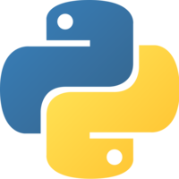

# PythonAchievements

## Overzicht
Dit zijn de afgeronde Python opdrachten van les 1-6 van de eerste periode, gemaakt door Patricia Kuipers.

## Inhoud
#### Les01:
* Play with Python
#### Les02:
* Poem Printing
* Player Statistics
* My first Operations
* How you like them Apples
* Interesting Tell Me More
* Family Ties
* Slice Wise
* In Variables we Trust
#### Les03:
* Daily Choices
* My logical Operators
* Deeply Nested
#### Les04:
* Where's Waldo
* The Final Countdown
#### Les05:
* Scooter
* Shuffle and Return
* Eat my String
#### Les06:
* Can you Handle the List
#### Other:
Dit zijn willekeurige bestanden die met Python te maken hebben, maar waarschijnlijk geen schoolopdrachten zijn.
